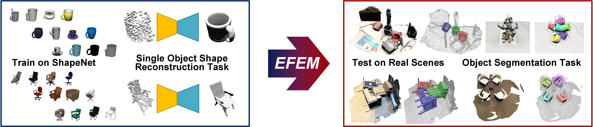

# CVPR23 EFEM

[Equivariant Neural Field Expectation Maximization for 3D Object Segmentation Without Scene Supervision](https://www.cis.upenn.edu/~leijh/projects/efem/)

[Jiahui Lei](https://www.cis.upenn.edu/~leijh/), [Congyue Deng](https://cs.stanford.edu/~congyue/), [Karl Schmeckpeper](https://sites.google.com/view/karlschmeckpeper), [Leonidas Guibas](https://geometry.stanford.edu/member/guibas/), [Kostas Daniilidis](https://www.cis.upenn.edu/~kostas/)

[Project Page](https://www.cis.upenn.edu/~leijh/projects/efem/), [Dataset Page](https://www.cis.upenn.edu/~leijh/projects/efem/chairs_and_mugs)



---

## Install

- Install by running `bash env.sh` (crete an anaconda virtual environment), note that this script is for cuda11.3, please change the corresponding versions to yours. *(Pyrender sometimes may not work in your environment, please check [here](https://pyrender.readthedocs.io/en/latest/install/index.html) and [Compatible  pyopengl](https://pyrender.readthedocs.io/en/latest/install/index.html#installpyopengl) for a proper installation)*
- **QuickStart: Now you have everything to run a quick demo `quickstart.ipynb` !**
- All three pre-trained shape prior network weights are contained in this repo and are downloaded when you clone. so no need for downloading any pre-trained weight.

---

## Inference

**1.) Prepare dataset**: create a dir named `data` under the project root, download the corresponding scene dataset you want to inference on:

- **Synthetic Sapien [link](https://drive.google.com/drive/folders/1U3_iVKyr_JTIsZKHnisomgj7m02JqAlU?usp=sharing)** (`sapien_testonly.zip`):
  we provide our physical plausible (advanced IR simulation) simulated scenes generated by [SAPIEN](https://sapien.ucsd.edu/). After unzipping, put the data like the following `ProjectRoot/data/sapien/mugs_novel_tree_normal`. Note, for inference purpose, you only need to download the `sapien_testonly.zip`, the other larger zip file `sapien.zip` contains training scenes for baselines.
- **Real Chairs and Mugs [link](https://www.cis.upenn.edu/~leijh/projects/efem/chairs_and_mugs)**: Fill in the form (takes ~30s) and get the downloading link of our novel real wrold testset with diverse object configurations. Put the data as, for example, `ProjectRoot/data/chairs_and_mugs/real_mugs_tree_normal_pth`

**2.) Prepare CodeBook (chairs and kit)**: the inference have to use the training object dataset for computing the absolute pose estimation by-products. The training object dataset is encoded as a codebook, you can prepare it by either of the following two ways (The cache for mugs is already contained in this repo when you clone it):

- [Recommend] Download our pre-computed codebook from [link](https://drive.google.com/drive/folders/1uAKOUL4mo8sCIH3IWDLctzAKxF-jg6Mg?usp=sharing) and put them into, for example, `ProjectRoot/cache/chairs.npz`

- Download the object shape prior training data from [link](https://drive.google.com/drive/folders/1qE0Nukw5FcWUqnOR1RUL6gmMgPeFtG73?usp=sharing) and put the unzipped data like the following: `ProjectRoot/data/ShapeNetV1_SDF/03001627` and `ProjectRoot/data/ShapeNetV1_SDF/03001627_dep`. Our code will automatically compute the codebook cache for you.


**3.) Example of Inference on Real Mugs Tree:**

```shell
python efem.py --config ./configs/real_mugs_tree.yaml
```

After running above command, you will find the corresponding outputs under `log`.

Visualize the output with output confidence threshold `0.0`, note the threshold is only for visualization purposes, more could be found in the paper Suppl. Tab.S1:

```shell
python efem_viz.py --config ./configs/real_mugs_tree.yaml -t 0.0
```

If you meet problem with visualization, most likely, the pyrender is not working properly. Maybe you could try to change the `egl` at the beginning of `lib_efem/render_helper.py` to `osmesa` for the CPU backend.

Compute the mAP metrics (this script is modified from [SoftGroup](https://github.com/thangvubk/SoftGroup)):

```shell
python standalone_eval_v2.py --results_dir ./log/real_mugs_tree/results_eval --gt_dir ./data/chairs_and_mugs/real_mugs_tree_normal_pth/test --n_sem 2 --n_ins 1 --postfix .pth
```

The metrics will be printed in the terminal and also saved in `log/real_mugs_tree/results_eval`

**More useful examples are in `example.sh`**

---

## Train object shape prior
If you want to train the shape prior and use your own weight instead of using our pre-trained models provided in this repo, you could try the following steps:

**1.) Prepare Dataset**:
Download the object shape prior training data from [link](https://drive.google.com/drive/folders/1qE0Nukw5FcWUqnOR1RUL6gmMgPeFtG73?usp=sharing) and put the unzipped data like the following: `ProjectRoot/data/ShapeNetV1_SDF/03797390` and `ProjectRoot/data/ShapeNetV1_SDF/03797390_dep_small`.

**2.) Train networks**:
you could use the following commands, for example, for mugs:
```shell
cd lib_shape_prior
python run.py --config ./configs/mugs.yaml -f
```
After training, you will find the output in `lib_shape_prior/log/shape_prior_mugs` (you could find this in the corresponding config `yaml` file with key `log_dir`). And the network weights are stored in `lib_shape_prior/log/shape_prior_mugs/checkpoint/`. In order to use these saved network weights, you have to specify (in your inference configuration) `field_pt` to the path of your weights and also remember to change the cache path `database_cache_fn` to a different one.

## Citation

If you find this code or our dataset useful, please cite our CVPR23 paper:
```latex
@inproceedings{Lei2023EFEM,
title={EFEM: Equivariant Neural Field Expectation Maximization for 3D Object Segmentation Without Scene Supervision},
author={Lei, Jiahui and Deng, Congyue and Schmeckpeper, Karl and Guibas, Leonidas and Daniilidis, Kostas},
booktitle={Proceedings of the IEEE/CVF Conference on Computer Vision and Pattern Recognition},
url={https://cis.upenn.edu/~leijh/projects/efem},
year={2023}
}      
```